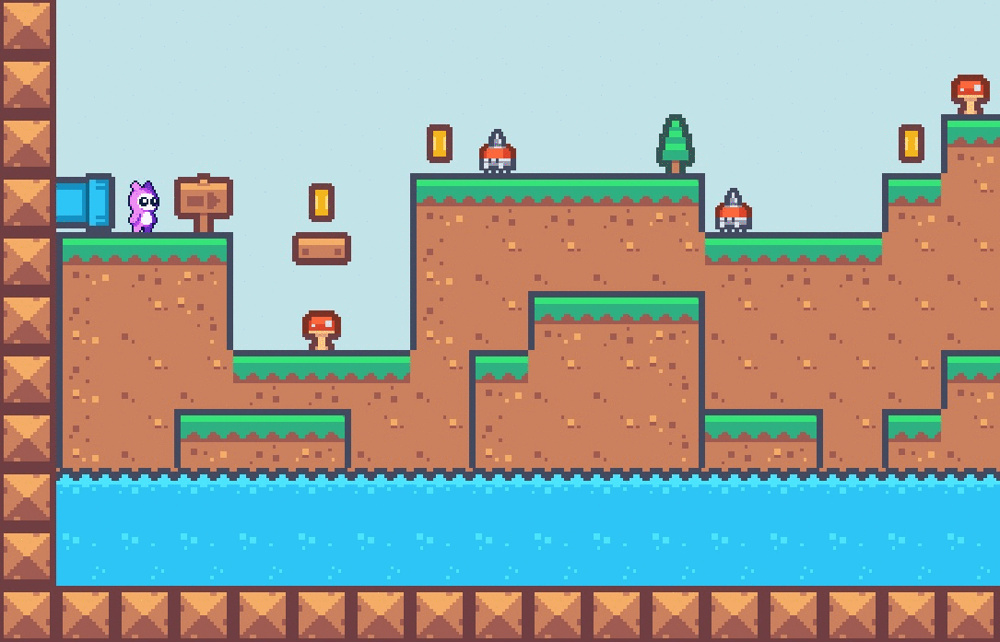
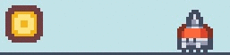
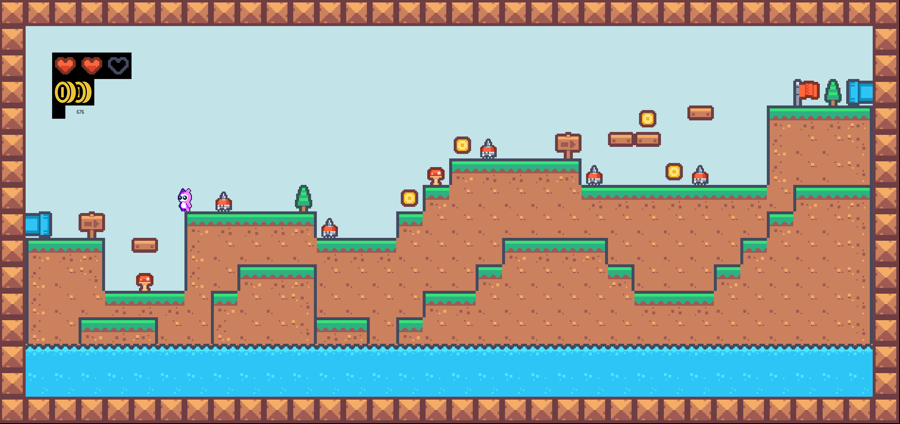

# So_Long
The "so_long" project at 42 School is a programming project designed to familiarize students with creating small 2D games using the MinilibX graphics library.

[![Contributors][contributors-shield]][contributors-url]
[![Forks][forks-shield]][forks-url]
[![Stargazers][stars-shield]][stars-url]
[![Issues][issues-shield]][issues-url]
[![LinkedIn][linkedin-shield]][linkedin-url]

## 📒 Index

- [About](#about)
- [Approach](#approach)
  - [Installation](#installation)
- [Development](#development)
  - [Pre-Requisites](#pre-requisites)
  - [File Structure](#file-structure)
  - [Diagram Architecture](#diagram-architecture)  
- [Notes](#notes)
- [Credits](#credits)

## About
The **So_Long** project is an introduction to *2D game development* for students at **42**. Using the **Minilibx library**, you will create a 2D game that includes:<br>

*4-way character movement (W, S, A, D)*<br>
*A move counter*<br>
*A map that must be a rectangle with a valid path*<br>
*A variety of restrictions/conditions to complete the project*<br>

**Here are some additional details about the project:**

*The game must be developed using the C programming language.*<br>
*The game must use the Minilibx library for graphics and input handling.*<br>
*The game must have a start and end point.*<br>
*The player must be able to move around the map.*<br>
*The player must be able to collect objects on the map.*<br>
*The player must avoid obstacles on the map.*<br>
*The game must have a win condition and a lose condition.*<br>

## Approach
From the start, I wanted to move away from the original project and explore a different path. My ambition was to create a top-down hack'n slash game that promised a fluid and enjoyable gameplay loop for the user. However, the time constraints forced me to favor a more familiar approach, while still keeping the two key points mentioned above.<br>

This is how this *"remastered Mario"* was born, taking up the iconic gameplay loop of this legendary game. You start on one of the game's maps, with the mission of collecting as many coins as possible. But be careful, you may not be alone on this treasure-filled path!<br>



I opted for a **2D oblique view**, *offering a dynamic and immersive perspective*. The graphic elements were recovered from the **Kenney website (free assets)** and then reworked in *Photoshop* to integrate perfectly with **the Minilibx environment**.<br>

In order to enrich the gameplay and bring an additional challenge, I introduced high structures and enemies. The player will thus be able to jump to overcome obstacles or dodge hostile monsters.<br>



*(The UI outlines (heart, coins, and step counter) are in black because my WSL has transparency issues with Minilibx, which will work correctly once on MacOS. I'm sorry again for this inconvenience, which bothers me slightly.)*<br>



### **Features**

**Breadth-First Search (BFS) algorithm:** *Used to determine if an exit is possible from the player's position on the map.*<br>

**Jumping ability:** *The player can now jump and descend more quickly by pressing the down arrow while in the air.*<br>

**Various animations:** *Added animations for monsters, coins, and the player.*<br>

**Player HUD:** *Displays information such as health, coins collected, and move count.*<br>

**Basic AI for monsters:** *Monsters follow a simple path and have a hitbox that can damage the player.*<br>

### **Features to be added:**

**Player-centered camera:** *To create a sense of progression in the game.*<br>

**Improved hitboxes and asset clipping:** *To prevent collision issues and improve the overall look of the game.*<br>

**Win and lose screens:** *To indicate the end of the game and provide feedback to the player.*<br>

**Scaling assets to 100x100:** *To reduce the player's X-axis and provide a better sense of movement.*<br>

## Installation
```bash
# Clone this repository
$ git clone https://github.com/HaruSnak/So_Long.git

# Go into the repository
$ cd So_Long

# To compile the program
$ make

# Execution example
$ ./so_long {NAME_MAP}.ber

# Allows you to do a complete cleaning of your construction environment
$ make fclean # Or make clean
```

## Development
### Pre-Requisites
```
Requirements for Linux

MinilibX only support TrueColor visual type (8,15,16,24 or 32 bits depth)
gcc
make
X11 include files (package xorg)
XShm extension must be present (package libxext-dev)
Utility functions from BSD systems - development files (package libbsd-dev)
e.g. sudo apt-get install gcc make xorg libxext-dev libbsd-dev (Debian/Ubuntu)
```

### File Structure

```
.
└── 📁so_long
    └── Makefile
    └── 📁assets
        └── 📁heart
            └── heart.xpm
            └── heart_empty.xpm
        └── 📁monsters
            └── monster_b.xpm
            └── monster_w.xpm
        └── 📁player
            └── ply_base.xpm
            └── ply_base_dps.xpm
            └── ply_base_r.xpm
            └── ply_jump.xpm
            └── ply_jump_r.xpm
            └── ply_walk.xpm
            └── ply_walk1.xpm
            └── ply_walk1_r.xpm
            └── ply_walk2.xpm
            └── ply_walk2_r.xpm
            └── ply_walk3.xpm
        └── 📁tiles
            └── bg.xpm
            └── cloud_center.xpm
            └── cloud_left.xpm
            └── cloud_right.xpm
            └── coin.xpm
            └── coin_r.xpm
            └── exit.xpm
            └── flag.xpm
            └── grass.xpm
            └── grass_center.xpm
            └── grass_l_c.xpm
            └── grass_left.xpm
            └── grass_r_c.xpm
            └── grass_right.xpm
            └── other_1.xpm
            └── other_2.xpm
            └── other_3.xpm
            └── platform.xpm
            └── sign_right.xpm
            └── start.xpm
            └── wall.xpm
            └── water_down.xpm
            └── water_up.xpm
        └── 📁ui
            └── eight_coin.xpm
            └── five_coin.xpm
            └── four_coin.xpm
            └── main_menu.xpm
            └── nine_coin.xpm
            └── one_coin.xpm
            └── seven_coin.xpm
            └── six_coin.xpm
            └── ten_coin.xpm
            └── three_coin.xpm
            └── two_coin.xpm
            └── walk.xpm
    └── 📁includes
        └── 📁libft
            └── Makefile
            └── 📁char
                └── ft_isalnum.c
                └── ft_isalpha.c
                └── ft_isascii.c
                └── ft_isdigit.c
                └── ft_isprint.c
                └── ft_tolower.c
                └── ft_toupper.c
            └── 📁conv
                └── ft_atoi.c
                └── ft_itoa.c
            └── 📁gnl
                └── get_next_line.c
            └── 📁includes
                └── libft.h
            └── 📁lst
                └── ft_lstadd_back_bonus.c
                └── ft_lstadd_front_bonus.c
                └── ft_lstclear_bonus.c
                └── ft_lstdelone_bonus.c
                └── ft_lstiter_bonus.c
                └── ft_lstlast_bonus.c
                └── ft_lstmap_bonus.c
                └── ft_lstnew_bonus.c
                └── ft_lstsize_bonus.c
            └── 📁mem
                └── ft_bzero.c
                └── ft_calloc.c
                └── ft_memchr.c
                └── ft_memcmp.c
                └── ft_memcpy.c
                └── ft_memmove.c
                └── ft_memset.c
            └── 📁printf
                └── ft_conv_primary.c
                └── ft_conv_specifies.c
                └── ft_conv_suit.c
                └── ft_printf.c
            └── 📁put
                └── ft_putchar.c
                └── ft_putchar_fd.c
                └── ft_putendl_fd.c
                └── ft_putnbr.c
                └── ft_putnbr_fd.c
                └── ft_putstr.c
                └── ft_putstr_fd.c
            └── 📁str
                └── ft_split.c
                └── ft_strchr.c
                └── ft_strdup.c
                └── ft_striteri.c
                └── ft_strjoin.c
                └── ft_strlcat.c
                └── ft_strlcpy.c
                └── ft_strlen.c
                └── ft_strmapi.c
                └── ft_strncmp.c
                └── ft_strnstr.c
                └── ft_strrchr.c
                └── ft_strtrim.c
                └── ft_substr.c
        └── so_long.h
    └── 📁maps
        └── error1.ber
        └── error10.ber
        └── error11.ber
        └── error2.ber
        └── error3.ber
        └── error4.ber
        └── error5.ber
        └── error6.ber
        └── error7.ber
        └── error8.ber
        └── error9.ber
        └── map1.ber
        └── map2.ber
        └── map3.ber
        └── mini2.ber
        └── mini3.ber
    └── 📁minilibx-linux
    └── 📁srcs
        └── 📁bonus
            └── 📁monster
                └── monster.c
            └── 📁player_bonus
                └── player_coin.c
        └── 📁errors
            └── errors.c
        └── 📁game
            └── settings.c
        └── 📁map
            └── draw.c
            └── path_include.c
        └── 📁parsing
            └── parsing.c
            └── path_bfs.c
            └── path_valid.c
        └── 📁player
            └── player.c
            └── player_animation.c
            └── player_collision.c
            └── player_gravity.c
        └── so_long.c
        └── 📁ui
            └── hud.c
            └── main_menu.c
```

### Diagram Architecture
Write the build Instruction here.

## Notes
You can optionally add a FAQ section about the project.

## Credits

Below you will find the links used for this project:

- [Norm 42](https://cdn.intra.42.fr/pdf/pdf/960/norme.en.pdf)
- [Docs Libs Minilibx | Harm-Smits](https://harm-smits.github.io/42docs/libs/minilibx/getting_started.html#installation)
- [Docs Libs Minilibx | Reactive](https://reactive.so/post/42-a-comprehensive-guide-to-so_long)
- [Events ARGS | Minilibx](https://tronche.com/gui/x/xlib/events/types.html)
- [Convertio | Format XPML](https://convertio.co/fr/png-xpm/)
- [AnyConv | Format XPM](https://anyconv.com/fr/convertisseur-de-png-en-xpm/)
- [Assets free | Kenney](https://kenney.nl/assets/pixel-platformer)

[contributors-shield]: https://img.shields.io/github/contributors/HaruSnak/So_long.svg?style=for-the-badge
[contributors-url]: https://github.com/HaruSnak/So_Long/graphs/contributors
[forks-shield]: https://img.shields.io/github/forks/HaruSnak/So_Long.svg?style=for-the-badge
[forks-url]: https://github.com/HaruSnak/So_Long/network/members
[stars-shield]: https://img.shields.io/github/stars/HaruSnak/So_Long.svg?style=for-the-badge
[stars-url]: https://github.com/HaruSnak/So_Long/stargazers
[issues-shield]: https://img.shields.io/github/issues/HaruSnak/So_Long.svg?style=for-the-badge
[issues-url]: https://github.com/HaruSnak/So_Long/issues
[linkedin-shield]: https://img.shields.io/badge/-LinkedIn-black.svg?style=for-the-badge&logo=linkedin&colorB=555
[linkedin-url]: https://www.linkedin.com/in/shany-moreno-5a863b2aa
